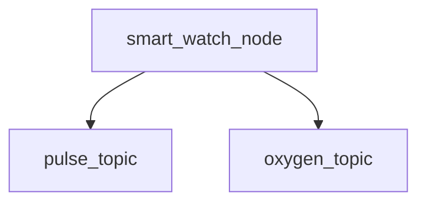

# Smart Watch Package - Okosóra szimuláció

Ez a csomag egy okosóra szimulációt valósít meg, amely két érzékelőt használ: egy pulzusmérőt és egy véroxigén szintmérőt. A csomag folyamatosan generálja a pulzus és véroxigén szint adatokat, és figyelmeztetéseket ad, ha a mért értékek kívül esnek a normális tartományokon.

## Node-ok és Topic-ok

### Node: `smart_watch_node`
A `smart_watch_node` egy ROS 2 node, amely két témát publikál:
- **`pulse_topic`**: A pulzus adatokat tartalmazó téma.
- **`oxygen_topic`**: A véroxigén szint adatokat tartalmazó téma.

A node minden 4 másodpercben új adatokat generál, és küldi ki azokat a megfelelő topic-okra.

### Pulzus adat
- **Téma**: `pulse_topic`
- **Típus**: `std_msgs/Float32`
- **Értékek**: Véletlenszerű pulzus értékek, 50 és 120 bpm között.
- **Figyelmeztetések**: Ha a pulzus értéke < 60 vagy > 100, akkor figyelmeztetés jelenik meg.

### Véroxigén szint adat
- **Téma**: `oxygen_topic`
- **Típus**: `std_msgs/Float32`
- **Értékek**: Véletlenszerű véroxigén szint értékek, 85 és 100% között.
- **Figyelmeztetések**: Ha a véroxigén szint < 90, akkor figyelmeztetés jelenik meg.

## Telepítés és futtatás

1. **Workspace létrehozása**:
   Ha még nem rendelkezel ROS 2 workspace-kel, hozd létre a következő parancsokkal:
   ```bash
   mkdir -p ~/ros2_ws/src
   cd ~/ros2_ws/src
   ```

2. **Csomag létrehozása**: Klónozd a csomagot a GitHub repository-ból a következő módon:
   ```bash
   git clone https://github.com/kissroli6/kis_hzx.git
   ```

3. **Build**: A csomag buildeléséhez navigálj a workspace gyökérkönyvtárába és használd a colcon build rendszert:
   ```bash
   cd ~/ros2_ws
   colcon build --packages-select smart_watch_package
   ```

4. **Workspace forrásolása**: Miután a build befejeződött, forrásold a workspace-t:
   ```bash
   source install/local_setup.bash
   ```

5. **A node futtatása**: A node futtatásához használd a következő parancsot:
   ```bash
   ros2 run smart_watch_package smart_watch_node
   ```

## Figyelmeztetések és értékek ellenőrzése

A program minden 4 másodpercben új pulzus és véroxigén adatokat generál. Ha a pulzus vagy véroxigén szint kívül esik a normális tartományokon, a rendszer figyelmeztetést küld a következő formában:
- **Pulzus túl alacsony**: Ha a pulzus értéke < 60 bpm.
- **Pulzus túl magas**: Ha a pulzus értéke > 100 bpm.
- **Véroxigén szint túl alacsony**: Ha a véroxigén szint < 90%.

## Csomag tartalom

A csomag a következő fájlokat tartalmazza:
- `smart_watch_package/`: A csomag fő könyvtára, amely tartalmazza a node kódját (pl. `pulse_oxygen_monitor.py`).
- `package.xml`: A csomag metaadatokat tartalmazó fájlja.
- `setup.py`: A csomag buildelését és telepítését segítő fájl.
- `README.md`: A csomag dokumentációja.
- `launch/`: A launch fájlokat (ha szükséges) ide kell helyezni.

## Diagramok

A node-ok és topic-ok viszonyát a következő mermaid diagram ábrázolja:


## GitHub Repository

A projekt elérhetősége: [https://github.com/kissroli6/kis_hzx](https://github.com/kissroli6/kis_hzx)
