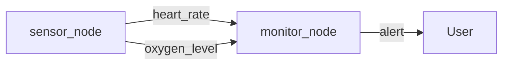

# Smart Watch Simulation

Ez a package egy okosóra szimulációját valósítja meg, amely két szenzort tartalmaz: egy pulzusmérőt és egy vér-oxigénszint mérőt. A szenzorok adatait két külön topicban hirdeti, és egy monitor node figyeli ezeket az adatokat, és riasztást küld, ha bármelyik érték túl magas vagy túl alacsony.

## Node-ok és Topic-ok

- `sensor_node`
  - Publikálja a pulzus adatokat a `heart_rate` topicban (`std_msgs/Float32` típus)
  - Publikálja a vér-oxigénszint adatokat az `oxygen_level` topicban (`std_msgs/Float32` típus)

- `monitor_node`
  - Feliratkozik a `heart_rate` és `oxygen_level` topicokra
  - Riasztást küld az `alert` topicban (`std_msgs/String` típus), ha bármelyik érték túl magas vagy túl alacsony

## Build és Futás

A package buildeléséhez és futtatásához kövesse az alábbi lépéseket:

1. Forráskód letöltése:
    ```bash
    git clone https://github.com/kissroli6/kis_hzx.git
    cd kis_hzx
    ```

2. Workspace buildelése:
    ```bash
    colcon build
    ```

3. Source a setup script:
    ```bash
    . install/setup.bash
    ```

4. Launch file futtatása:
    ```bash
    ros2 launch smart_watch smart_watch_launch.py
    ```

## Diagram


